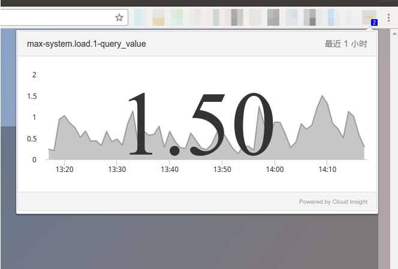
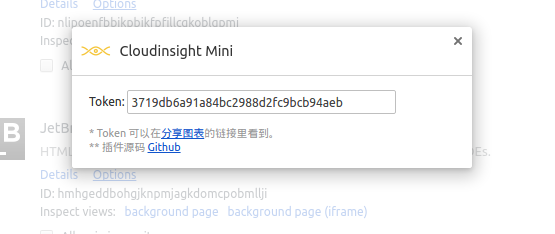

# Cloudinsight Mini

这是一个用来在你的 `Chrome` 工具栏显示 `Cloudinsight` 图表的插件。

## 安装

[Chrome Store](https://chrome.google.com/webstore/detail/cloudinsight-mini/klihmpniaaakjmniddmicfclpkjijkao)

## 效果图

## 设置页面

## 变更历史

[CHANGELOG.md](./CHANGELOG.md)

## 开源协议

